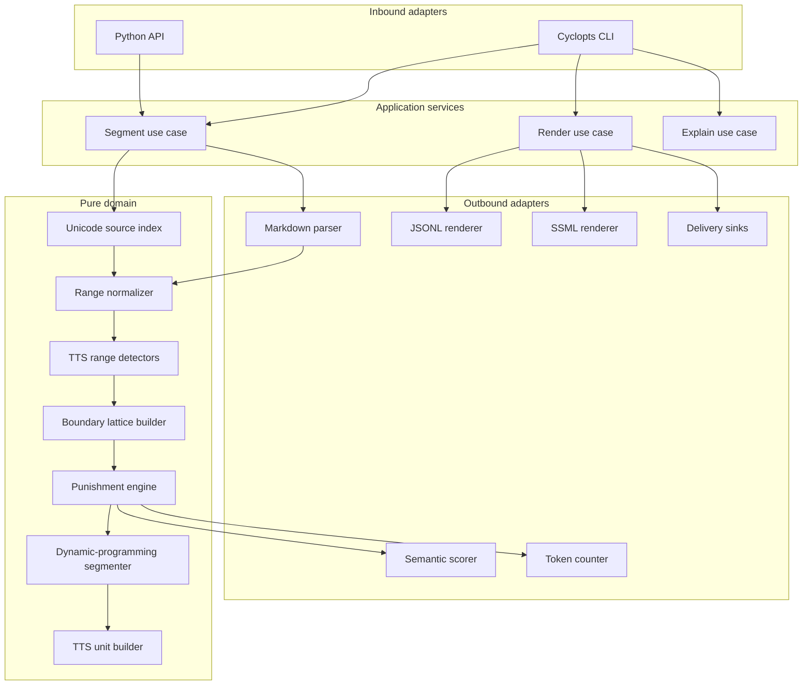

# Prosidy Darn technical design

## 1. Design context

Prosidy Darn is a Python package for splitting Markdown and narrative prose
into directable text-to-speech (TTS) units. It must work as both a Python
library and an agent-native command-line interface (CLI).

The design adapts the `darn-it` chunking model to speech direction. `darn-it`
parses Markdown with Rust's `markdown` crate, turns source ranges into a
punishment vector, and solves chunking as a bounded shortest-path problem. Its
public package documents custom punishment rules, token mode, overlap, and
dynamic-programming optimisation over literal source offsets.[^1] Prosidy Darn
keeps the literal-slice and global-optimisation properties, but changes the
objective from preserving Markdown chunks to preserving performance beats.

The Rust `markdown` crate exposes
`to_mdast(value, options) -> Result<Node, Message>` and includes source
positions such as line, column, and offset ranges in its example syntax tree.[
^2] The `mdast` Python package already wraps the same `markdown-rs` project and
publishes Python wheels for CPython 3.8+ on Linux x86-64 and Arm64.[^3] Prosidy
Darn should treat that binding as the first parser adapter, then add a small
PyO3 range extractor only if the binding does not expose source positions in a
stable enough shape.

Speech Synthesis Markup Language (SSML) is the first renderer target, not the
source of truth. W3C SSML defines document structure, pronunciation, prosody,
voice, pause, and marker elements, and its synthesis process explicitly allows
processors to infer structure and normalization when markup does not provide
it. [^4] SSML also notes that processor behaviour can vary by synthesis engine.
Prosidy Darn therefore keeps an engine-neutral cue intermediate representation
(IR) and compiles it to SSML or vendor-specific payloads.

Cloudflare's 2026 CLI work reinforces the CLI design requirement: agents are
now primary CLI consumers, and consistency needs schema-level enforcement, not
manual review. Their public design standardizes `get`, `list`, `--force`, and
`--json`, and exposes runtime API shape for agents.[^5] Prosidy Darn applies
the same agent-native principles to a smaller Python CLI.

Cyclopts is the CLI framework and tiered configuration mechanism. Its
configuration API allows an `App` to receive one callable or a sequence of
callables that inject parsed values, including built-in TOML, environment, and
dictionary sources. Cyclopts documents the effective precedence as CLI
arguments, then environment variables, then TOML, then Python defaults when
those sources are ordered accordingly.[^6]

## 2. Goals and non-goals

### 2.1. Goals

- Emit non-overlapping `TTSUnit` records whose source span is always a literal
  slice of the original input.
- Preserve enough Markdown and prose structure to avoid damaging headings,
  tables, lists, code blocks, paragraphs, sentences, dialogue turns, and quote
  attribution.
- Optimise segmentation globally, not greedily, so an awkward local cut can be
  chosen when it preserves a more valuable later structure.
- Optimise units for speech direction using estimated duration, speaker
  consistency, dialogue handling, semantic breaks, and renderer constraints.
- Expose the same segmentation engine through a Python library and a CLI.
- Provide deterministic default behaviour that works offline without a model or
  TTS provider.
- Support optional semantic-break scoring and optional TTS rendering without
  making either dependency mandatory for core segmentation.
- Provide an agent-native CLI with non-interactive defaults, `--json`
  everywhere, bounded output, stable exit codes, `agent-context`, profiles,
  delivery sinks, and local feedback capture.
- Use `pytest`, `pytest-bdd`, `syrupy`, and Hypothesis as the normative test
  stack for unit coverage, behaviour scenarios, snapshot contracts, and
  property-based verification.
- Use Rich for human CLI output while keeping JSON, JSONL, `agent-context`, and
  other machine-facing output clean ASCII unless source text requires Unicode.

### 2.2. Non-goals

- Prosidy Darn does not synthesize audio in the core package.
- Prosidy Darn does not rewrite, summarize, or improve source prose.
- Prosidy Darn does not claim to infer correct dramatic intent from text alone.
- Prosidy Darn does not make SSML the canonical editing format.
- Prosidy Darn does not require a Rust extension for all users in the first
  implementation phase.
- Prosidy Darn does not implement a full discourse parser in the minimum viable
  product (MVP).
- Prosidy Darn does not use Rich for machine-readable output.

## 3. Terminology

| Term             | Definition                                                                                                           |
| ---------------- | -------------------------------------------------------------------------------------------------------------------- |
| Source text      | The immutable input string supplied by the caller.                                                                   |
| Source range     | A half-open range over source text, with inclusive start and exclusive end offsets.                                  |
| TTS unit         | A non-overlapping directable cue span emitted by the segmenter.                                                      |
| Spoken text      | Text derived from the source range for a TTS engine after Markdown syntax removal and text normalization.            |
| Boundary         | A candidate source position where one TTS unit can end and the next can start.                                       |
| Punishment       | A numeric cost applied to a candidate boundary or candidate unit. Lower cost is better; infinite cost means illegal. |
| Performance beat | A source span that can receive one coherent delivery instruction.                                                    |
| Profile          | A named set of segmentation, duration, rendering, and CLI defaults.                                                  |
| Renderer         | A compiler from the cue IR to SSML, JSONL, WebVTT-like cues, or vendor payloads.                                     |
| Synthesis window | A larger source span sent to a TTS engine for context while retaining audio only for one or more cue units.          |

_Table 1: Normative terminology used by the design._

## 4. Architectural summary

Prosidy Darn uses hexagonal architecture around a pure segmentation domain. The
domain owns source ranges, cue units, punishment rules, profiles, and the
shortest-path segmenter. Inbound adapters expose the domain through a Python
API and a Cyclopts CLI. Outbound adapters provide Markdown parsing, optional
semantic scoring, tokenization, delivery sinks, and renderers.

All dependencies point inward. Domain modules must not import Cyclopts,
`mdast`, PyO3 extension modules, HTTP clients, filesystem delivery code, or TTS
vendor libraries. Ports belong to the domain or application layer; adapters
implement those ports.

The boundary matters. Markdown parsing needs byte-accurate structural ranges,
which `markdown-rs` already provides. TTS policy needs fast iteration,
inspectable profiles, optional Python ecosystem integrations, and friendly
configuration. The Rust layer should remain a parser or range oracle until
profiling proves that Python dynamic programming is too slow.

For screen readers: Figure 1 shows input flowing through parsing, range
detection, scoring, dynamic programming, unit construction, and renderers
across hexagonal ports and adapters.



_Figure 1: Prosidy Darn hexagonal architecture and segmentation flow._

## 5. Ports and adapters

The bounded context is TTS cue segmentation. The domain operation is: given
source text, structural ranges, optional semantic scores, and a profile,
produce an ordered partition of directable cue units plus diagnostics.

### 5.1. Driving ports

Driving ports expose use cases to callers:

| Port                  | Responsibility                                  | Inbound adapters                |
| --------------------- | ----------------------------------------------- | ------------------------------- |
| `SegmentText`         | Convert source text to `TTSUnit` records.       | Python API, Cyclopts `segment`. |
| `RenderUnits`         | Convert `TTSUnit` records to a renderer target. | Python API, Cyclopts `render`.  |
| `ExplainSegmentation` | Report accepted and rejected boundary costs.    | Python API, Cyclopts `explain`. |
| `ManageProfiles`      | List, read, save, and delete named profiles.    | Python API, Cyclopts `profile`. |

_Table 2: Driving ports and their inbound adapters._

### 5.2. Driven ports

Driven ports describe dependencies the domain or application layer needs from
outside code:

| Port              | Responsibility                                       | Outbound adapters                          |
| ----------------- | ---------------------------------------------------- | ------------------------------------------ |
| `StructureParser` | Return source ranges for Markdown or plain text.     | `mdast`, PyO3 `markdown-rs`, plain text.   |
| `SemanticScorer`  | Return optional cohesion-drop scores at boundaries.  | Disabled scorer, embedding scorer.         |
| `TokenCounter`    | Enforce optional token limits.                       | Disabled counter, tokenizer adapter.       |
| `CueRenderer`     | Render units to a target artefact.                   | JSONL, SSML, WebVTT-like, vendor payloads. |
| `ProfileStore`    | Persist named CLI profiles.                          | XDG TOML store.                            |
| `DeliverySink`    | Deliver artefacts to stdout, file, or webhook.       | Stdout, atomic file, webhook.              |
| `FeedbackStore`   | Persist local feedback and optionally post upstream. | JSONL state file, webhook endpoint.        |

_Table 3: Driven ports and their outbound adapters._

Adapters never call each other directly. For example, the Cyclopts CLI adapter
does not call the SSML renderer adapter. It invokes `RenderUnits`, which
selects the configured `CueRenderer` port implementation through the
composition root.

## 6. Domain model

The cue IR is the stable contract between segmentation, rendering, and editing
tools.

```python
from __future__ import annotations

import dataclasses as dc
import enum
import typing as typ


class UnitKind(enum.StrEnum):
    NARRATION = "narration"
    DIALOGUE = "dialogue"
    ATTRIBUTION = "attribution"
    DIALOGUE_WITH_ATTRIBUTION = "dialogue_with_attribution"
    INTERNAL_MONOLOGUE = "internal_monologue"
    ACTION = "action"
    DESCRIPTION = "description"
    TRANSITION = "transition"
    MIXED = "mixed"


@dc.dataclass(frozen=True, slots=True)
class SourceRange:
    kind: str
    start_char: int
    end_char: int
    start_byte: int
    end_byte: int
    attributes: dict[str, object] = dc.field(default_factory=dict)


@dc.dataclass(frozen=True, slots=True)
class SpokenSpan:
    source_start: int
    source_end: int
    spoken_start: int
    spoken_end: int
    kind: str
    voice: str | None = None
    attributes: dict[str, object] = dc.field(default_factory=dict)


@dc.dataclass(frozen=True, slots=True)
class PerformanceDirection:
    intent: str | None = None
    pace: str | None = None
    energy: str | None = None
    pitch: str | None = None
    volume: str | None = None
    tension: float | None = None
    pause_before_ms: int = 0
    pause_after_ms: int = 0
    emphasis: tuple[str, ...] = ()


@dc.dataclass(frozen=True, slots=True)
class TTSUnit:
    id: str
    source_start: int
    source_end: int
    source_text: str
    spoken_text: str
    spoken_spans: tuple[SpokenSpan, ...]
    kind: UnitKind
    speaker: str | None
    direction: PerformanceDirection
    diagnostics: tuple[str, ...] = ()
```

The design stores both character and byte offsets in `SourceRange`. Python
string slicing uses code-point offsets. Rust string slicing requires valid
UTF-8 byte offsets. The index bridge is part of the core domain because source
stability is a correctness property, not a parser implementation detail.

```python
@dc.dataclass(frozen=True, slots=True)
class SourceIndex:
    text: str
    byte_to_char: dict[int, int]
    char_to_byte: tuple[int, ...]
```

`TTSUnit.source_text` must always equal
`source_text[unit.source_start:unit.source_end]`. `spoken_text` may differ when
Markdown syntax, pronunciation overrides, emphasis markers, or normalized
symbols need a TTS-friendly rendering.

## 7. Segmentation algorithm

### 7.1. Source range extraction

The structure parser extracts Markdown ranges for:

- headings,
- paragraphs,
- lists and list items,
- blockquotes,
- code blocks,
- tables, rows, and cells,
- emphasis and strong emphasis,
- links,
- inline code,
- thematic breaks.

The TTS detectors add synthetic ranges for:

- words,
- sentences,
- clauses,
- paragraph boundaries,
- dialogue quotes,
- quote attribution,
- dialogue turns,
- speaker turns,
- parentheticals,
- abbreviations and initialisms,
- pronunciation-sensitive tokens,
- semantic and emotional beats.

The normalizer merges overlapping or adjacent ranges of the same kind when they
would otherwise double-charge the same boundary. This preserves the useful
`darn-it` property that one structural violation receives one punishment.

### 7.2. Boundary lattice

The segmenter should score a bounded lattice rather than every source index.
The lattice contains, in priority order:

1. document start and end,
2. chapter and scene breaks,
3. paragraph boundaries,
4. dialogue-turn boundaries,
5. sentence boundaries,
6. clause boundaries after semicolons, colons, commas, dashes, and conjunctions,
7. word boundaries,
8. grapheme-safe emergency boundaries.

The builder may include low-priority emergency boundaries only when no
higher-tier path can satisfy hard renderer limits. It must never create a
boundary inside a Unicode scalar value or grapheme cluster.

### 7.3. Boundary punishment

Boundary punishment describes the cost of ending a unit at a position,
independent of the span that produced it.

| Boundary condition                             | Cost     |
| ---------------------------------------------- | -------: |
| Inside a grapheme cluster                      | Infinity |
| Inside a UTF-8 code point                      | Infinity |
| Inside a word                                  | 100000   |
| Inside an abbreviation, decimal, or initialism | 50000    |
| Inside inline code                             | 50000    |
| Inside a code block                            | 40000    |
| Inside a table cell                            | 25000    |
| Inside a sentence                              | 1200     |
| Inside a dialogue quote                        | 900      |
| Between quote and attached attribution         | 700      |
| Inside a list item                             | 300      |
| Inside a paragraph                             | 250      |
| After a comma                                  | 180      |
| After a semicolon or colon                     | 80       |
| After sentence-ending punctuation              | -300     |
| At a dialogue-turn boundary                    | -450     |
| At a paragraph boundary                        | -650     |
| At a scene break                               | -1200    |

_Table 4: Initial boundary punishment values for the default profile._

Static values are not enough. The punishment engine must support shaped rules:

- paragraph-internal cuts use inverse-triangular punishment, so the centre of a
  forced paragraph cut is cheaper than either edge;
- heading-adjacent cuts use a decaying punishment after the heading, so a
  heading keeps following context;
- quote-attribution separation uses profile-specific punishment, because a
  single-narrator audiobook usually keeps the quote and tag together while a
  dramatised renderer may use subspans;
- semantic-break rewards scale with local cohesion drop, but never override
  hard structural illegality.

### 7.4. Unit punishment

Unit punishment describes the cost of choosing a span `(start, end)` as one TTS
unit. This is the main difference from `darn-it`: a boundary can be good while
the resulting unit is bad.

```python
def unit_cost(start: int, end: int, context: SegmentContext) -> float:
    return (
        duration_cost(start, end, context)
        + directability_cost(start, end, context)
        + speaker_consistency_cost(start, end, context)
        + internal_break_cost(start, end, context)
        + renderer_limit_cost(start, end, context)
        + orphan_cost(start, end, context)
    )
```

The default duration model estimates seconds from word count and punctuation:

```python
estimated_seconds = (
    word_count / words_per_second
    + comma_count * 0.12
    + semicolon_count * 0.20
    + sentence_end_count * 0.28
    + paragraph_break_count * 0.45
)
```

The default profile uses:

- ideal duration: 4 to 12 seconds,
- soft maximum: 18 seconds,
- hard maximum: 28 seconds,
- minimum: 1.5 seconds unless the unit is a complete deliberate beat.

```python
def duration_cost(seconds: float, profile: TTSProfile) -> float:
    if seconds > profile.hard_max_seconds:
        return INF
    if seconds < profile.minimum_seconds:
        return 600 * (profile.minimum_seconds - seconds) ** 2
    if profile.ideal_min_seconds <= seconds <= profile.ideal_max_seconds:
        return 0
    if seconds < profile.ideal_min_seconds:
        return 80 * (profile.ideal_min_seconds - seconds) ** 2
    return 40 * (seconds - profile.ideal_max_seconds) ** 2
```

The design deliberately permits very short units when a stronger reward
justifies them. A one-word dialogue turn can be a valid cue. A stray orphan
clause normally is not.

### 7.5. Dynamic programming

The segmenter solves a bounded shortest-path problem over candidate positions.
An edge from `i` to `j` represents one candidate `TTSUnit`.

```python
def segment_positions(
    positions: list[int],
    cut_cost: dict[int, float],
    edge_cost: typ.Callable[[int, int], float],
) -> list[int]:
    dp = [INF] * len(positions)
    next_index = [-1] * len(positions)
    dp[-1] = 0.0

    for i in range(len(positions) - 2, -1, -1):
        start = positions[i]
        for j in successor_indices(i, positions):
            end = positions[j]
            current_edge_cost = edge_cost(start, end)
            if current_edge_cost >= INF:
                continue
            fullness_bonus = -0.001 * estimated_seconds(start, end)
            cost = current_edge_cost + cut_cost.get(end, 0.0) + dp[j] + fullness_bonus
            if cost < dp[i]:
                dp[i] = cost
                next_index[i] = j

    return reconstruct_path(positions, next_index)
```

`successor_indices` limits the search by hard duration, character count, token
count, and renderer limits. The bounded search keeps the algorithm close to
`darn-it`'s dynamic programme while adding edge costs.

If no path exists, the segmenter follows a diagnostic fallback ladder:

1. allow sentence-internal clause boundaries;
2. allow quote-internal sentence boundaries;
3. allow word boundaries;
4. allow grapheme-safe emergency boundaries;
5. fail with an error that reports the offending source span and active limits.

The final step must not silently split inside a word.

## 8. Profiles and configuration

Cyclopts owns CLI-level tiered configuration. The composition root builds the
Cyclopts app with a configuration sequence equivalent to:

```python
app = cyclopts.App(
    name="prosidy-darn",
    config=[
        cyclopts.config.Env("PROSIDY_DARN_"),
        cyclopts.config.Toml(
            "prosidy-darn.toml",
            root_keys=["tool", "prosidy-darn"],
            search_parents=True,
        ),
        cyclopts.config.Dict(load_named_profile, source="profile"),
    ],
)
```

Cyclopts' own precedence rule means explicitly provided CLI arguments still win
over injected values. Prosidy Darn therefore standardizes the full precedence
order as:

1. explicit CLI flag,
2. `PROSIDY_DARN_` environment variable,
3. project TOML under `[tool.prosidy-darn]`,
4. named profile from the XDG profile store,
5. Python default.

Library callers bypass Cyclopts and pass `SegmentOptions` directly. This keeps
configuration injection out of the domain and prevents CLI framework types from
leaking into Python library usage.

Profiles define segmentation policy without changing the algorithm.

```toml
[profile.audiobook_single_narrator]
ideal_seconds = [4.0, 12.0]
hard_max_seconds = 28.0
words_per_second = 2.6
allow_nested_voice_spans = false
quote_attribution_separation = "high"
dialogue_turn_reward = "high"
paragraph_boundary_reward = "medium"

[profile.dramatised_multivoice]
ideal_seconds = [3.0, 10.0]
hard_max_seconds = 20.0
words_per_second = 2.9
allow_nested_voice_spans = true
quote_attribution_separation = "medium"
speaker_change_boundary_reward = "very_high"
dialogue_turn_reward = "very_high"

[profile.low_latency_streaming]
ideal_seconds = [2.0, 6.0]
hard_max_seconds = 10.0
words_per_second = 2.8
prefer_short_units = true
semantic_breaks = "disabled"
```

The on-disk profile store lives under
`${XDG_CONFIG_HOME:-~/.config}/prosidy-darn/profiles.toml`. The CLI exposes
profile names through `agent-context` so agents can discover available
configuration without parsing local files.

## 9. Library API

The public API should make common usage short and keep lower-level machinery
available for tests and tooling.

```python
from prosidy_darn import SegmentOptions, TTSProfile, segment_markdown

units = segment_markdown(
    markdown_text,
    options=SegmentOptions(
        profile=TTSProfile.audiobook_single_narrator(),
        output_spoken_text=True,
    ),
)
```

The package layout follows the ports-and-adapters boundary:

| Module                                     | Responsibility                                                     |
| ------------------------------------------ | ------------------------------------------------------------------ |
| `prosidy_darn.domain.index`                | Unicode source index construction and offset conversion.           |
| `prosidy_darn.domain.ranges`               | Source range types, merging, and validation.                       |
| `prosidy_darn.domain.detectors`            | Word, sentence, clause, dialogue, attribution, and beat detectors. |
| `prosidy_darn.domain.scoring`              | Boundary and unit punishment rules.                                |
| `prosidy_darn.domain.segmenter`            | Lattice construction and dynamic programming.                      |
| `prosidy_darn.domain.ir`                   | Cue IR dataclasses and serialization-neutral structures.           |
| `prosidy_darn.application.segment`         | `SegmentText` use case orchestration.                              |
| `prosidy_darn.application.render`          | `RenderUnits` use case orchestration.                              |
| `prosidy_darn.application.explain`         | `ExplainSegmentation` use case orchestration.                      |
| `prosidy_darn.ports`                       | Protocols for driven ports.                                        |
| `prosidy_darn.adapters.inbound.cli`        | Cyclopts command definitions and agent-context generation.         |
| `prosidy_darn.adapters.outbound.markdown`  | `mdast`, PyO3, and plain-text parser adapters.                     |
| `prosidy_darn.adapters.outbound.renderers` | JSONL, SSML, WebVTT-like, and vendor renderers.                    |
| `prosidy_darn.adapters.outbound.delivery`  | Stdout, file, webhook, and feedback adapters.                      |
| `prosidy_darn.config`                      | Composition root and Cyclopts configuration wiring.                |

_Table 5: Proposed ports-and-adapters package boundaries._

The core library must not import optional heavy dependencies at module import
time. Optional semantic scoring, tokenization, and renderer integrations load
behind explicit options.

## 10. Markdown adapter strategy

The default adapter order is:

1. use the `mdast` Python package if it exposes stable source positions;
2. use a local PyO3 range extractor around `markdown::to_mdast` if `mdast`
   omits positions or exposes only line and column data;
3. use a plain-text fallback when Markdown parsing is unavailable and the input
   does not require Markdown-aware protection.

The PyO3 fallback should return a compact range stream rather than a complete
abstract syntax tree:

```json
[
  {"kind": "heading", "start_byte": 0, "end_byte": 8, "depth": 1},
  {"kind": "paragraph", "start_byte": 10, "end_byte": 42},
  {"kind": "list", "start_byte": 44, "end_byte": 60},
  {"kind": "list_item", "start_byte": 44, "end_byte": 51}
]
```

The parser layer never renders Markdown back to text. It contributes only
source ranges and structural attributes. `source_text` always comes from the
original input slice.

## 11. Renderer strategy

The renderer interface compiles `TTSUnit` records to target formats.

```python
class Renderer(typ.Protocol):
    name: str

    def render(self, units: cabc.Sequence[TTSUnit], options: RenderOptions) -> str:
        """Render cue units to a target format."""
```

The first renderers are:

- JSONL cue sheet for stable editing and diffing;
- SSML 1.1 for standards-based TTS markup;
- WebVTT-like cue export after timing data exists;
- vendor payload renderers for engines that do not accept portable SSML.

The SSML renderer maps:

- `TTSUnit.id` to `<mark>` names,
- paragraph and sentence structure to `<p>` and `<s>`,
- pause hints to `<break>`,
- emphasis to `<emphasis>`,
- pronunciation overrides to `<phoneme>` or `<sub>`,
- rate, pitch, and volume hints to `<prosody>`,
- nested voice spans to `<voice>` only for profiles and providers that allow
  it.

SSML compilation must remain lossy by design. The cue IR is authoritative; SSML
is a delivery artefact whose exact behaviour depends on the synthesis processor.

## 12. Synthesis windows

Cue units are non-overlapping. Prosidy Darn must not copy retrieval-style
overlap into spoken output because duplicated source text becomes duplicated
speech.

Instead, the planner may create synthesis windows:

```plaintext
cue units:       [0..177] [177..287] [287..468]
synthesis 1:     [0..227], keep [0..177]
synthesis 2:   [127..337], keep [177..287]
synthesis 3:   [237..468], keep [287..468]
```

This allows paragraph or cross-sentence context to reach a TTS engine while
keeping retained audio aligned to non-overlapping cue units. Paragraph-level
TTS research supports the value of cross-sentence linguistic and prosodic
context for synthesis quality.[^7]

Synthesis windows belong in renderer or provider planning, not in core unit
segmentation.

## 13. CLI contract

The CLI name is `prosidy-darn`. Command vocabulary follows agent-native
conventions:

- use `get`, not `info`;
- use `list`, not `ls`;
- use `--json` for structured output;
- use `--force` for destructive confirmation bypass;
- write data to stdout and diagnostics to stderr;
- suppress ANSI colour when stdout is not a terminal;
- bound list outputs by default.

The command tree is:

```plaintext
prosidy-darn
  segment
  render
  explain
  profile list
  profile get
  profile save
  profile delete
  agent-context
  feedback
  feedback list
```

`segment` reads Markdown from `--input <path>` or stdin and writes JSONL by
default:

```bash
prosidy-darn segment --input story.md --profile audiobook --json
```

`render` converts an existing cue sheet to a target format:

```bash
prosidy-darn render --input cues.jsonl --format ssml --output story.ssml --json
```

`explain` emits the accepted boundaries and nearby rejected candidates:

```bash
prosidy-darn explain --input story.md --profile audiobook --json --limit 20
```

The `agent-context` command returns a versioned JSON schema for command
discovery:

```json
{
  "schema_version": "1",
  "commands": {
    "segment": {
      "flags": {
        "--input": {"type": "path", "required": false},
        "--profile": {"type": "string", "required": false},
        "--json": {"type": "bool", "default": false},
        "--limit": {"type": "integer", "default": 100}
      }
    }
  },
  "available_profiles": ["audiobook_single_narrator", "dramatised_multivoice"]
}
```

Exit codes are stable:

| Code | Meaning                                |
| ---: | -------------------------------------- |
| 0    | Success.                               |
| 1    | Unexpected internal error.             |
| 2    | Invalid invocation or malformed flags. |
| 3    | Input file or output path error.       |
| 4    | Input parsing failed.                  |
| 5    | No valid segmentation path exists.     |
| 6    | Rendering failed.                      |
| 7    | Configuration or profile error.        |

_Table 6: CLI exit code taxonomy._

All enum validation errors must include the valid values. Unknown delivery
schemes must report the supported set:

```plaintext
error: --deliver scheme must be one of: stdout, file:<path>, webhook:<url>
```

Cyclopts is the command specification source. The CLI adapter defines commands
once with Cyclopts metadata, then derives:

- human `--help`,
- `agent-context`,
- documentation snippets,
- vocabulary checks,
- enum validation and error messages.

The Cyclopts adapter also owns non-interactive behaviour. Commands must not
prompt when stdin is not a terminal. Destructive commands require `--force`,
and future confirmation flows must expose structured alternatives rather than
interactive menus.

The schema layer enforces banned aliases such as `info`, `ls`, `--format=json`,
and `--skip-confirmations`.

Rich owns human-facing terminal rendering only. The CLI may use Rich tables,
panels, progress indicators, and colour when stdout is a terminal and `--json`
is not set. Rich output must be disabled for non-terminal stdout, `--json`,
`agent-context`, JSONL cue sheets, SSML, WebVTT-like output, and any command
intended for agent consumption.

Machine-facing output must remain clean ASCII unless it is carrying source
text, spoken text, pronunciation data, or user-provided content that is already
Unicode. Diagnostic keys, enum values, command names, and error categories stay
ASCII so agents can parse them without terminal-style decoration or typographic
punctuation.

## 14. Delivery and feedback

The CLI supports `--deliver` on commands that produce artefacts:

- `stdout`,
- `file:<path>`,
- `webhook:<url>`.

File delivery writes to a temporary file in the destination directory and then
atomically replaces the target. Webhook delivery posts the rendered artefact
and reports HTTP status in JSON.

The `feedback` command records agent and user friction locally:

```bash
prosidy-darn feedback "explain output omits the rejected quote boundary"
```

Feedback entries are JSON Lines under
`${XDG_STATE_HOME:-~/.local/state}/prosidy-darn/feedback.jsonl`. If
`PROSIDY_DARN_FEEDBACK_ENDPOINT` is set, the CLI also posts the entry upstream
and reports the HTTP status. `agent-context` reports whether an upstream
feedback endpoint is configured.

## 15. Failure modes

| Failure                                    | Response                                                                                         |
| ------------------------------------------ | ------------------------------------------------------------------------------------------------ |
| Markdown parser omits positions            | Fall back to the PyO3 range extractor or fail with a parser capability diagnostic.               |
| Markdown input is malformed MDX            | Report parse failure before segmentation; plain Markdown should not fail for normal syntax.      |
| No segmentation path satisfies hard limits | Run the fallback ladder, then fail with exit code 5 and the offending span.                      |
| Optional semantic model is unavailable     | Continue with deterministic structural scoring and report a diagnostic when requested.           |
| Renderer rejects nested voice spans        | Flatten to profile-compatible output or fail with an actionable renderer error.                  |
| Webhook delivery fails                     | Preserve the local artefact when possible and report HTTP status on stderr or JSON error output. |
| Profile is invalid                         | Reject before processing input and enumerate valid profile keys or enum values.                  |

_Table 7: Expected failure modes and required responses._

## 16. Verification strategy

The design has three correctness properties that need explicit verification.

**Source-slice integrity.** For every emitted unit,
`unit.source_text == original[unit.source_start:unit.source_end]`. Property
tests should generate Unicode-rich Markdown and prose, including smart quotes,
combining marks, emoji, accented names, and non-Latin scripts.

**Coverage and ordering.** Without synthesis windows, the emitted units form a
complete non-overlapping partition of the source: `units[0].source_start == 0`,
each `units[n].source_end == units[n + 1].source_start`, and
`units[-1].source_end == len(source)`.

**Boundary legality.** The segmenter never chooses a boundary inside a UTF-8
code point, grapheme cluster, or word unless the emergency ladder explicitly
permits a grapheme-safe fallback and records a diagnostic.

The main combinatorial surface is the product of profiles, Markdown features,
renderer formats, and input modes. The minimum coverage set is:

- plain text and Markdown inputs;
- ASCII and non-ASCII inputs;
- default, audiobook, dramatised, and low-latency profiles;
- JSONL and SSML renderers;
- file and stdin input modes;
- stdout, file, and webhook delivery schemes;
- valid and invalid enum values.

The verification scope does not prove that inferred emotion, speaker, or
dramatic intent is correct. The system must expose those in editable metadata
and diagnostics instead of presenting inference as ground truth.

The test stack is:

| Tool         | Design role                                                                                                            |
| ------------ | ---------------------------------------------------------------------------------------------------------------------- |
| `pytest`     | Own unit and integration execution for domain, application, and adapter tests.                                         |
| `pytest-bdd` | Own behaviour scenarios for CLI workflows, renderer contracts, profile precedence, and delivery schemes.               |
| `syrupy`     | Own stable snapshots for `agent-context`, explanation output, JSONL cue sheets, SSML fragments, and human Rich output. |
| Hypothesis   | Own property tests for Unicode source slicing, coverage, ordering, boundary legality, and fallback-ladder behaviour.   |

_Table 8: Normative verification tool roles._

`syrupy` snapshots must avoid incidental churn. Synthetic Markdown fixtures,
timestamps, profile names, and generated unit identifiers need deterministic
values. Rich snapshot tests capture terminal output separately from JSON and
JSONL output so human formatting cannot leak into agent-facing contracts.

`pytest-bdd` scenarios cover externally observable behaviour rather than
internal implementation steps. At minimum, scenarios exercise:

- `segment` from stdin and file input;
- `explain` with bounded output;
- profile precedence across flags, `PROSIDY_DARN_` variables, project TOML, and
  named profiles;
- JSON output without Rich formatting;
- human output with Rich formatting when attached to a terminal;
- failure messages that enumerate valid enum values;
- `--deliver=stdout`, `--deliver=file:<path>`, and
  `--deliver=webhook:<url>`.

Hexagonal architecture adds one fitness function: `prosidy_darn.domain` and
`prosidy_darn.application` must not import from `prosidy_darn.adapters` or
Cyclopts. The CI gate should include an import-boundary check before the first
non-trivial adapter lands.

## 17. Implementation phasing

### 17.1. MVP

- Define cue IR dataclasses and JSONL serialization.
- Build Unicode source index and range validation.
- Integrate `mdast` as the first Markdown adapter and verify position support.
- Implement plain-text fallback ranges for paragraphs, words, and sentences.
- Implement boundary lattice construction.
- Implement default boundary and unit punishment.
- Implement dynamic-programming segmentation.
- Implement Cyclopts-backed `segment`, `explain`, `profile`, `agent-context`,
  and `feedback` CLI commands.
- Implement Cyclopts tiered configuration through `Env`, `Toml`, and named
  profile sources.
- Implement Rich human output behind terminal and `--json` checks.
- Implement JSONL output and explain diagnostics.
- Add `pytest`, `pytest-bdd`, `syrupy`, and Hypothesis coverage for the domain
  invariants, CLI behaviour, and output contracts.

### 17.2. First renderer release

- Implement spoken-text extraction from Markdown source.
- Implement SSML renderer with `<mark>`, `<p>`, `<s>`, `<break>`,
  `<emphasis>`, `<prosody>`, `<phoneme>`, and `<sub>` support.
- Implement renderer capability checks for nested voice spans.
- Implement `render` and `--deliver`.

### 17.3. Semantic scoring release

- Add optional sentence embedding adapters.
- Add semantic-break scoring as a reward, not a hard rule.
- Add internal-break unit punishment.
- Add synthesis-window planning for providers that benefit from context.

## 18. Open decisions

- Whether the package should depend directly on `mdast` or vendor a minimal
  PyO3 range extractor from the start.
- Which tokenizer should provide optional token limits.
- Whether profile files should allow arbitrary custom rule expressions or only
  named rule weights.
- Which vendor renderer should be the first non-SSML target.
- Which import-boundary checker should enforce hexagonal dependency rules.

## 19. References

[^1]: [`darn-it` 1.2.0 on PyPI](https://pypi.org/project/darn-it/), accessed
    2026-05-09.
[^2]: [`markdown::to_mdast` documentation](https://docs.rs/markdown/latest/markdown/fn.to_mdast.html),
    accessed 2026-05-09.
[^3]: [`mdast` 0.2.1 on PyPI](https://pypi.org/project/mdast/), accessed
    2026-05-09.
[^4]: [W3C Speech Synthesis Markup Language 1.1 Recommendation](https://www.w3.org/TR/speech-synthesis11/),
    accessed 2026-05-09.
[^5]: [Cloudflare, "Building a CLI for all of Cloudflare"](https://blog.cloudflare.com/cf-cli-local-explorer/),
    accessed 2026-05-09.
[^6]: [Cyclopts configuration documentation](https://cyclopts.readthedocs.io/en/latest/config_file.html),
    accessed 2026-05-09.
[^7]: [Xue et al., "ParaTTS: Learning Linguistic and Prosodic Cross-sentence Information in Paragraph-based TTS"](https://arxiv.org/abs/2209.06484),
    accessed 2026-05-09.
